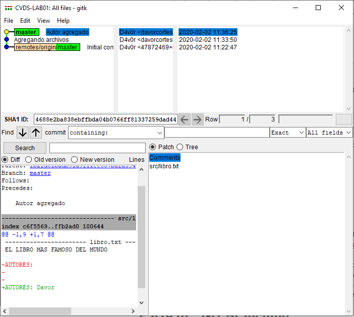
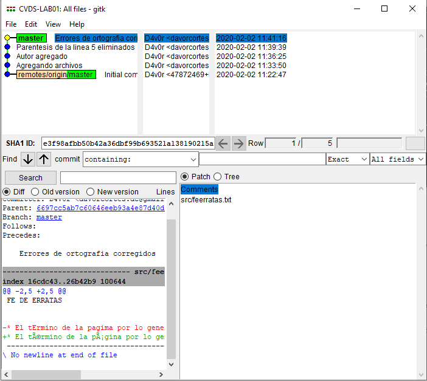
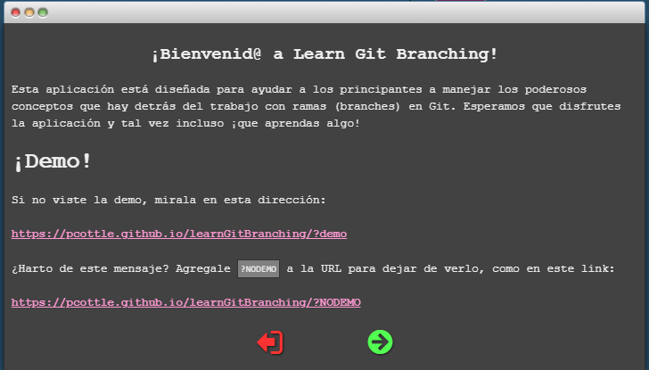

# Laboratorio 1 - Introducción GIT - 2020-1

* Universidad: _Escuela Colombiana de Ingeniería_
* Asignatura:  _Ciclos de Vida de Desarrollo de Software_
* Autor: _Davor Cortés_

## Parte l.- Creando repositorios

Utilice en comando `gitk` para verificar el historial de cambios sobre el repositorio.

Usando el comando `gitk`, ¿Qué diferencia hay ahora en el historial de cambios en el repositorio?

## Parte II. - Introducción General GIT

Enlaces:
  * <https://git-scm.com/doc>
  * <http://ndpsoftware.com/git-cheatsheet.html>
  * <https://commonmark.org/help/tutorial/>

## Parte III. - GIT Branching

